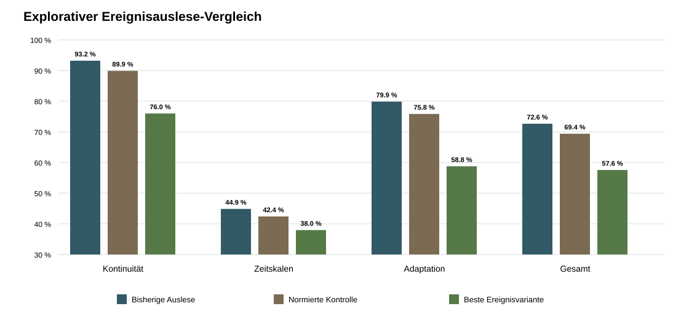

# FELDCHIP_SIMULATION

Reproduzierbares mathematisches `4×4`-Referenzmodell für einen hypothetischen
feldbasierten Sensorprozessor im normierten Arbeitsbereich `−3…+3`. Der
Projektname **Wahrnehmungschip** bezeichnet ausschließlich eine technisch
messbare Sensor-zu-Feld-Abbildung.

Das Repository enthält Simulationsmodelle, Vorregistrierungen und vollständige
Ergebnisdaten. Es enthält keinen gefertigten Chip und keinen nachgewiesenen
Energie-, Leistungs- oder Verarbeitungsvorteil.

## Aktueller Stand

- Eine zuverlässige Rückführung ist im Modell technisch nachgewiesen. Der
  Referenzkandidat verwendet konstante Rückführung `1,6` und koppelt die
  Abweichung vom Referenzfeld.
- Positive symmetrische Nachbarschaftskopplung zeigte weder bei statischen noch
  bei zeitlich-räumlichen Aufgaben einen Vorteil gegenüber den Baselines.
- Gerichtete und anisotrope Kopplung lieferte keinen Kandidaten und ist für die
  untersuchte Aufgabe abgeschlossen.
- Mehrere lokale Zeitskalen lieferten einen explorativen Kandidaten. Im
  unabhängigen Bestätigungslauf blieb dessen Effekt positiv, erreichte mit
  `1,18` Prozentpunkten aber nicht die geforderte Mindestgröße von `2,0`.
- Das Intervall liegt bei `+0,15` bis `+2,21` Punkten. Da nicht alle
  vorregistrierten Bedingungen erfüllt sind, gilt der Vorteil als nicht
  bestätigt.
- Lokale begrenzte Adaptation lieferte ebenfalls keinen Kandidaten. Die stärkste
  technisch zugelassene Variante erreichte `+1,02` Punkte, verfehlte damit die
  Mindestwirkung und lag bei einer Rauschstufe unter der Baseline.
- Die ereignisbasierte Endakkumulator-Auslese lieferte keinen Kandidaten. Selbst
  die stärkste Variante lag `15,08` Punkte hinter der bisherigen und `11,82`
  Punkte hinter der normierten Auslese.



Die aktuelle Suchphase ist abgeschlossen. Im geprüften Modell bleibt die
ungekoppelte Ein-Zustands-Dynamik mit Mittelwert-/Steigungs-Auslese die
belastbare Referenz. Ein neuer Abschnitt beginnt erst mit einer Hypothese zu
einer konkreten physikalischen Ursache oder einem klaren Anwendungsbedarf. Der
Forschungsrahmen steht in
[`ARCHITEKTUR_NEUAUSRICHTUNG.md`](ARCHITEKTUR_NEUAUSRICHTUNG.md).
Die drei Anwendungshypothesen sind im
[`Hypothesenpapier zur physikalischen Wahrnehmungsebene`](Docs/HYPOTHESENPAPIER_PHYSIKALISCHE_WAHRNEHMUNGSEBENE.md)
festgehalten; eine Auswahl wurde noch nicht getroffen.

## Reproduzieren

Voraussetzung ist Python 3.11 oder neuer.

```powershell
python -m venv .venv
.venv\Scripts\Activate.ps1
python -m pip install -r requirements.txt
python -m unittest discover -s tests -v
python run_experiment.py
python run_compact_readout.py
python run_temporal_experiment.py
python run_return_experiment.py
python run_anisotropic_experiment.py
python run_multiscale_experiment.py
python run_multiscale_confirmation.py
python run_adaptation_experiment.py
python run_event_readout_experiment.py
```

Die veröffentlichten Hauptläufe wurden jeweils vollständig wiederholt. Die
zugehörigen Berichte enthalten die bitgenau verglichenen SHA-256-Prüfsummen.

## Dokumentation

| Abschnitt | Vorregistrierung oder Plan | Ergebnis |
|---|---|---|
| Statische Referenz und kompakte Auslese | [`FORSCHUNGSPLAN.md`](FORSCHUNGSPLAN.md) | [`results/`](results/), [`results_compact/`](results_compact/) |
| Zeitlich-räumlicher Hauptversuch | [`TEMPORALER_VERSUCHSPLAN.md`](TEMPORALER_VERSUCHSPLAN.md) | [`results_temporal/`](results_temporal/) |
| Technische Rückführung | [`RUECKFUEHRUNG_VORREGISTRIERUNG.md`](RUECKFUEHRUNG_VORREGISTRIERUNG.md) | [`results_return/`](results_return/) |
| Gerichtete und anisotrope Kopplung | [`ANISOTROPE_KOPPLUNG_VORREGISTRIERUNG.md`](ANISOTROPE_KOPPLUNG_VORREGISTRIERUNG.md) | [`results_anisotropic/`](results_anisotropic/) |
| Mehrere lokale Zeitskalen | [`MEHRERE_ZEITSKALEN_VORREGISTRIERUNG.md`](MEHRERE_ZEITSKALEN_VORREGISTRIERUNG.md) | [`results_multiscale/`](results_multiscale/) |
| Unabhängige Zeitskalen-Bestätigung | [`BESTAETIGUNG_ZEITSKALEN_VORREGISTRIERUNG.md`](BESTAETIGUNG_ZEITSKALEN_VORREGISTRIERUNG.md) | [`results_multiscale_confirmation/`](results_multiscale_confirmation/) |
| Lokale begrenzte Adaptation | [`ADAPTATION_VORREGISTRIERUNG.md`](ADAPTATION_VORREGISTRIERUNG.md) | [`results_adaptation/`](results_adaptation/) |
| Ereignisbasierte zeitliche Auslese | [`EREIGNISAUSLESE_VORREGISTRIERUNG.md`](EREIGNISAUSLESE_VORREGISTRIERUNG.md) | [`results_event_readout/`](results_event_readout/) |

Konzept- und Konstruktionspapiere liegen unter [`Docs/`](Docs/).

## Wissenschaftliche Grenze

Alle Aussagen gelten nur für die jeweils vorregistrierten dimensionslosen
Modelle, Aufgaben und Ausleseverfahren. SPICE-Modelle, reale Bauteilstreuung,
Temperaturverhalten, elektrische Energie und Fertigbarkeit erfordern getrennte
Untersuchungen. Negative und neutrale Ergebnisse bleiben dokumentiert.
