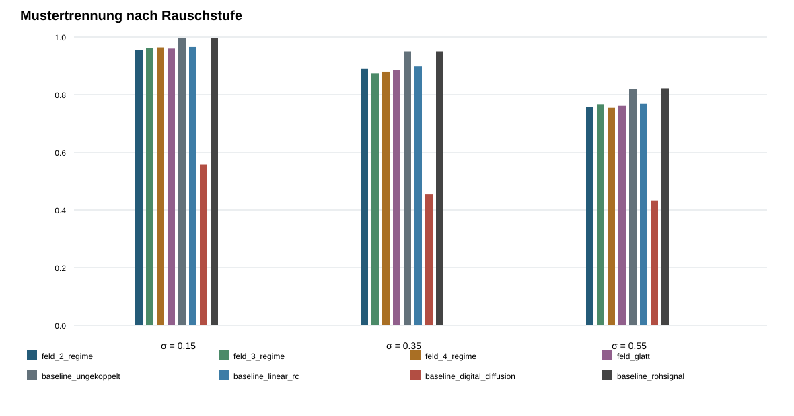

# FELDCHIP_SIMULATION

Reproduzierbares mathematisches Referenzmodell für einen hypothetischen
feldbasierten Sensorprozessor. Ein gekoppeltes `4×4`-Zellfeld bildet räumliche
Eingangssignale in kontinuierliche Zustände im normierten Arbeitsbereich
`−3…+3` ab und kehrt nach dem Eingangspuls zu einem Referenzfeld zurück.

Der Projektname **Wahrnehmungschip** bezeichnet in den begleitenden Papieren
ausschließlich diese technisch messbare Sensor-zu-Feld-Abbildung.

Die bisher getestete positive, symmetrische Nachbarschaftskopplung wird nach
drei Simulationsabschnitten nicht als Vorteilskandidat weitergeführt. Die neue
Leitfrage und die möglichen Mechanismen sind in
[`ARCHITEKTUR_NEUAUSRICHTUNG.md`](ARCHITEKTUR_NEUAUSRICHTUNG.md) festgelegt.
Die technische Rückführung wurde getrennt gemäß
[`RUECKFUEHRUNGS_ARBEITSPAKET.md`](RUECKFUEHRUNGS_ARBEITSPAKET.md) geprüft.
Das genaue Protokoll wurde vor Ausführung in
[`RUECKFUEHRUNG_VORREGISTRIERUNG.md`](RUECKFUEHRUNG_VORREGISTRIERUNG.md)
festgelegt.

## Forschungsstatus

Das Repository enthält eine prüfbare Arbeitshypothese und einen ersten
Referenzversuch. Es enthält keinen fertigen Schaltplan, keinen gefertigten Chip
und keinen nachgewiesenen Energie- oder Leistungsvorteil.

Der erste Lauf vergleicht bei identischem Arbeitsbereich:

- zwei Rückführungsregime,
- drei Rückführungsregime,
- vier Rückführungsregime,
- eine geglättete Dreiregime-Kennlinie,
- ein ungekoppeltes dynamisches Sensorarray,
- ein lineares RC-Diffusionsnetz,
- digitale Diffusion mit 12-Bit-Quantisierung,
- das unverarbeitete Rohsignal.

## Aktueller Befund

Die technische Rückführungsprüfung lässt `10` von `87` Kandidaten zu. Alle drei
nach vorregistrierter Rangfolge ausgewählten Kandidaten bestehen zusätzlich die
Zeitschrittprüfung. Der bestplatzierte Kandidat verwendet konstante
Rückführungsverstärkung `1,6`, Kopplungsstärke `0,34` und die Kopplung der
Abweichung vom Referenzfeld. Seine schlechteste 95-%-Einschwingzeit beträgt
`2,726 s`, sein schlechtester Restfehler `0,00618`; Grenzverletzungen traten
nicht auf.

Damit existieren im mathematischen Modell technisch rückführbare Kandidaten.
Dies ist noch kein Nachweis eines Verarbeitungsvorteils und keine Auswahl einer
Architektur für eine reale Schaltung.

Der erste explorative Architekturmechanismus ist vor Ausführung in
[`ANISOTROPE_KOPPLUNG_VORREGISTRIERUNG.md`](ANISOTROPE_KOPPLUNG_VORREGISTRIERUNG.md)
festgelegt. Der zugehörige Ergebnislauf wurde noch nicht gestartet.

Der vorregistrierte zeitlich-räumliche Hauptversuch umfasst zehn Sequenzklassen
und eine für alle Modelle identische 16-Kanal-Auslese. Die beste Feldvariante
`feld_glatt` erreicht `85,3 %`; die beste Baseline
`baseline_ungekoppelt` erreicht `89,7 %`. Die gepaarte Differenz beträgt `−4,5`
Prozentpunkte mit einem approximativen 95-%-Intervall von `−5,5` bis `−3,5`
Prozentpunkten. Beide vorregistrierten Erfolgskriterien werden verfehlt.

Der zeitliche Zustand ist in dieser Parametrierung besonders bei stärkerem
Rauschen nützlich, ein zusätzlicher Nutzen der räumlichen Kopplung ist jedoch
nicht nachgewiesen. Vielmehr liegt das ungekoppelte dynamische Array in der
festgelegten Aufgabe vor allen gekoppelten Feldvarianten. Dieser Befund gilt
nicht automatisch für andere Kopplungstopologien oder zeitliche Auslesen.

Der zuvor abgeschlossene statische Lauf ergab:

Über sechs Eingangsmuster, drei Rauschstufen und fünf feste Zufallsstarts
erreichte die beste Feldvariante `86,9 %` Mustertrennung. Die Rohsignal-Baseline
erreichte `92,3 %`. Die Feldvarianten lagen nur `0,3` Prozentpunkte auseinander.

Damit gilt für die untersuchte Vollfeldauslese:

- reproduzierbar unterscheidbare Feldformen: **beobachtet**,
- Einhaltung des Bereichs `−3…+3`: **beobachtet**,
- besonderer Vorteil einer Regimezahl: **nicht nachgewiesen**,
- Vorteil gegenüber der besten Baseline: **nicht nachgewiesen**,
- ausreichend schnelle Rückführung: **mit der aktuellen Parametrierung nicht erreicht**.

Die Ergebnisse dürfen nicht auf andere Aufgaben oder eine reale Schaltung
übertragen werden, ohne diese gesondert zu prüfen.




## Reproduzieren

Voraussetzung ist Python 3.11 oder neuer.

```powershell
python -m venv .venv
.venv\Scripts\Activate.ps1
python -m pip install -r requirements.txt
python -m unittest discover -s tests -v
python run_experiment.py
python run_temporal_experiment.py
```

Der Hauptlauf erzeugt `120` aggregierte Modellläufe. Seine beiden zentralen
CSV-Dateien wurden in zwei vollständigen Wiederholungen bitgenau identisch
erzeugt.

## Ergebnisse

- [`ERGEBNISBERICHT.md`](results/ERGEBNISBERICHT.md): Befunde und Grenzen
- [`summary.csv`](results/summary.csv): aggregierte Kennzahlen
- [`trials.csv`](results/trials.csv): alle Seeds und Rauschstufen
- [`manifest.json`](results/manifest.json): vollständige Versuchsparameter
- [`accuracy_comparison.svg`](results/accuracy_comparison.svg): Modellvergleich
- [`field_examples.svg`](results/field_examples.svg): beispielhafte Feldkarten

Zeitlich-räumlicher Hauptversuch:

- [`ERGEBNISBERICHT.md`](results_temporal/ERGEBNISBERICHT.md): Ergebnis und Aussagegrenze
- [`summary.csv`](results_temporal/summary.csv): aggregierte Kennzahlen
- [`trials.csv`](results_temporal/trials.csv): alle gepaarten Einzelwerte
- [`manifest.json`](results_temporal/manifest.json): vorab festgelegte Parameter
- [`accuracy_comparison.svg`](results_temporal/accuracy_comparison.svg): Vergleich nach Rauschstufe

Technische Rückführungsprüfung:

- [`ERGEBNISBERICHT.md`](results_return/ERGEBNISBERICHT.md): technischer Befund
- [`trials.csv`](results_return/trials.csv): vollständiger Hauptsweep
- [`dt_validation.csv`](results_return/dt_validation.csv): Zeitschrittprüfung
- [`manifest.json`](results_return/manifest.json): Auswahl und bestätigte Kandidaten

## Projektstruktur

```text
Docs/                         Konzept- und Konstruktionspapiere
src/feldchip_simulation.py    Modell, Baselines und Auswertung
src/temporal_experiment.py    vorregistrierter zeitlich-räumlicher Versuch
src/return_experiment.py      vorregistrierte Rückführungsprüfung
src/anisotropic_experiment.py gerichtete und anisotrope Kopplung
tests/test_simulation.py      mathematische und reproduktive Tests
run_experiment.py             ausführbarer Referenzversuch
run_temporal_experiment.py    ausführbarer zeitlich-räumlicher Hauptversuch
run_return_experiment.py      noch nicht ausgeführter Rückführungssweep
run_anisotropic_experiment.py noch nicht ausgeführte Architektur-Exploration
results/                      Manifest, Rohwerte, Bericht und Diagramme
FORSCHUNGSPLAN.md             aktueller Forschungsstand und Reihenfolge
ARCHITEKTUR_NEUAUSRICHTUNG.md Regeln für die weitere Mechanismensuche
RUECKFUEHRUNGS_ARBEITSPAKET.md technische Pflichtprüfung
RUECKFUEHRUNG_VORREGISTRIERUNG.md festes Prüfprotokoll
ANISOTROPE_KOPPLUNG_VORREGISTRIERUNG.md erster Architekturversuch
```

## Wissenschaftliche Grenze

Das Modell prüft dimensionslose Dynamik, Trennbarkeit, Reproduzierbarkeit,
Rückführung und Bereichseinhaltung. Es ersetzt weder eine SPICE-Simulation mit
realistischen Bauteilmodellen noch Messungen an physischer Hardware. Der
Aktivitätswert ist keine elektrische Energiemessung.

Neue Varianten werden nur dann als Fortschritt gewertet, wenn sie eine vorher
festgelegte Messgröße gegenüber denselben Baselines verbessern. Negative und
neutrale Ergebnisse bleiben Bestandteil der Dokumentation. Neue
Architekturvarianten werden erst nach einem getrennten Plan für technische
Eignung, explorative Auswahl und vorregistrierte Bestätigung gerechnet.
