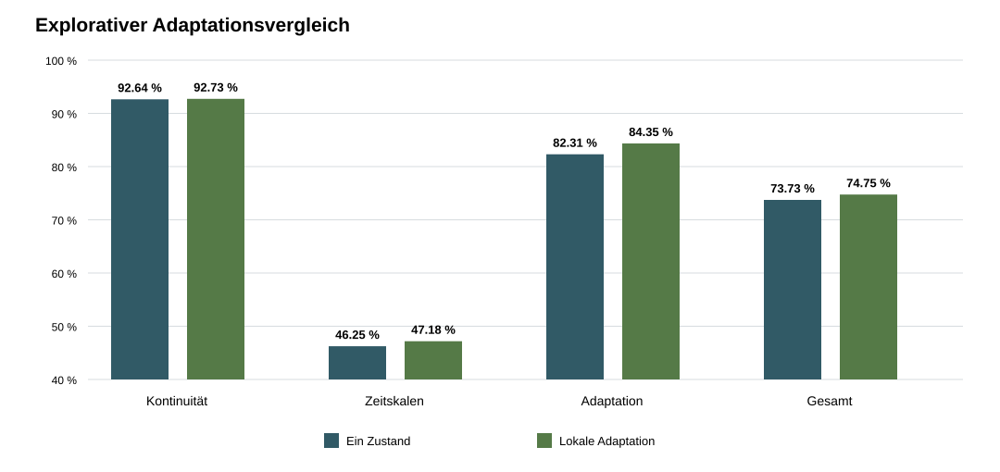

# Ergebnisbericht: lokale begrenzte Adaptation

## Ergebnis

Kein Kandidat erfüllt die vorregistrierte Auswahlregel. Der Mechanismus liefert in diesem begrenzten Suchraum keinen Kandidaten für einen unabhängigen Bestätigungslauf.

## Technische Zulassung

Die Baseline und `22` von `24` Adaptationsvarianten erfüllen sämtliche technischen Kriterien. Nicht zugelassen sind `adaptation_r0.6_b0.75_a1` und `adaptation_r0.6_b1_a1`; beide überschreiten in mindestens einer Bedingung die vorregistrierte t95-Grenze von `5,0 s`. Rückkehrrate, Restfehler, erneuter Toleranzaustritt und Grenzüberschreitungen sind dort nicht die ausschlaggebenden Fehler.

## Stärkster zugelassener Befund

Die stärkste beobachtete Variante ist `adaptation_r1.2_b0.75_a1`. Sie ist keine ausgewählte Bestätigungsvariante.

Die Gesamttrennrate beträgt `73.73 %` für die Baseline und `74.75 %` für diese Variante. Die gepaarte Differenz ist `+1.02` Prozentpunkte; das approximative 95-%-Intervall reicht von `+0.19` bis `+1.85` Prozentpunkten.

Kontinuität: `+0.09` Punkte. Zeitskalen: `+0.93` Punkte. Adaptation: `+2.04` Punkte.

Rauschen `0,15`: `+2.55` Punkte. Rauschen `0,35`: `-0.46` Punkte. Rauschen `0,55`: `+0.97` Punkte.

| Vorregistrierte Bedingung | Ergebnis | Erfüllt |
|---|---:|:---:|
| Gesamtdifferenz größer als `2,0` Punkte | +1.02 | nein |
| Alle drei Aufgabenmittel mindestens null | +0.09 | ja |
| Alle drei Rauschmittel mindestens null | -0.46 | nein |

Der positive Gesamtwert genügt nicht: Die Mindestwirkung wird verfehlt und das mittlere Ergebnis bei Rauschstufe `0,35` ist negativ. Die Schwellen werden nicht nachträglich verändert.

## Abbildung

## Reproduzierbarkeit

Zwei vollständige Ausführungen erzeugten die zentralen Dateien bitgenau identisch.

Nach der Ausführung wurden ausschließlich Bericht und Vergleichsgrafik ergänzt. Simulationsdaten, Kandidatenvergleich und Auswahlentscheidung blieben unverändert.

- `technical_screen.csv`: SHA-256 `4F8DDF4F6FB293AE66F16B99392551BC30FD8BE77D6B3953677624594B49E6BD`
- `task_trials.csv`: SHA-256 `B9CB9C9F77C12E4B6A027837B35ADB9A7F7FB321F4F6D66CF1F36660F0D37311`
- `comparisons.csv`: SHA-256 `115C5FE13B548BF598C2A71CD16ED25793320AFDC88F635D93F1F2D2E55E0FEE`
- `manifest.json`: SHA-256 `31C5F4B844F22946FD5A4D14C5F8AF032519AA46D43182EC9E5CEA2BBBF48A47`

## Aussagegrenze

Das Ergebnis gilt nur für den vorregistrierten dimensionslosen Kandidatenraum, die drei Aufgaben und die verwendete Auslese. Es belegt weder einen allgemeinen Nachteil lokaler Adaptation noch einen Chipvorteil oder elektrische Realisierbarkeit.
