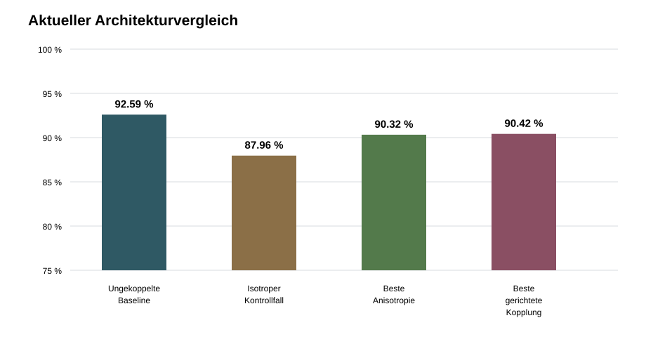

# Ergebnisbericht: gerichtete und anisotrope Kopplung

## Technische Zulassung

Von 26 Modellen sind `26` technisch zugelassen. Die schlechteste 95-%-Einschwingzeit beträgt `3.243 s`, der größte 95-%-Restfehler `0.00803`. Insgesamt traten `0` versuchte Grenzüberschreitungen auf.

## Explorative Auswahl

Kein Modell erfüllt die vorregistrierten Bedingungen für einen späteren Bestätigungslauf.

Die ungekoppelte Pflichtbaseline erreicht `92.59 %`. Der isotrope Kontrollfall erreicht `87.96 %` und liegt damit `-4.63` Prozentpunkte relativ zur Baseline.

| Familie | bestes Modell | Trennrate | Differenz zur Baseline | approximatives 95-%-Intervall |
|---|---|---:|---:|---:|
| anisotrop | `anisotrop_horizontal_d0.34_t0` | 90.32 % | -2.27 Punkte | -3.03 bis -1.51 Punkte |
| gerichtet | `gerichtet_rechts_d0.34_g0` | 90.42 % | -2.18 Punkte | -3.22 bis -1.13 Punkte |

Auch die jeweils besten neuen Modelle liegen bei jeder einzelnen Rauschstufe im Mittel unter der Baseline. Der Mechanismus liefert in diesem festgelegten Aufgaben- und Ausleseschema daher kein Signal für einen Bestätigungslauf.

## Abbildung

## Reproduzierbarkeit

Zwei vollständige Ausführungen erzeugten die zentralen Dateien bitgenau identisch.

- `technical_screen.csv`: SHA-256 `9370332019D2641BCE4C3C76D4A2F7AE4AE6258D7714371D1D15A1983E6E921A`
- `task_trials.csv`: SHA-256 `BCC1A812901FB47E0F211DC305C081543BD36D578DBCDB00CECB7FBFA3153D68`
- `comparisons.csv`: SHA-256 `F63D984E3433E5DA0F1CA9D0629DDB8C2E94C60E80FF7F855BA68A506A88FBDF`
- `manifest.json`: SHA-256 `9BBB835E90FDD8D38DE178F07E7C7CAA660AA3D061A2521E3C428D432D5E31FC`

## Aussagegrenze

Das Ergebnis ist explorativ und gilt nur für den festgelegten Kandidatenraum, die zehn Sequenzklassen und die gemeinsame Auslese. Es bestätigt keinen allgemeinen Verarbeitungsvorteil und macht keine Aussage über elektrische Realisierbarkeit.
