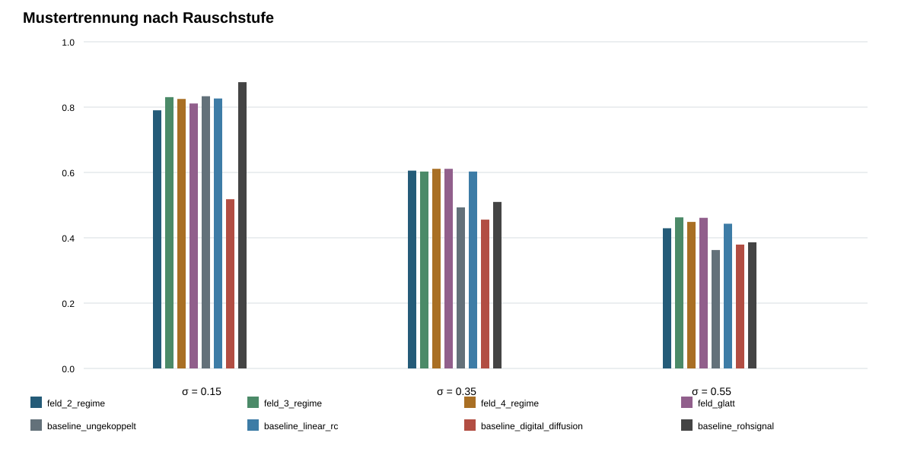
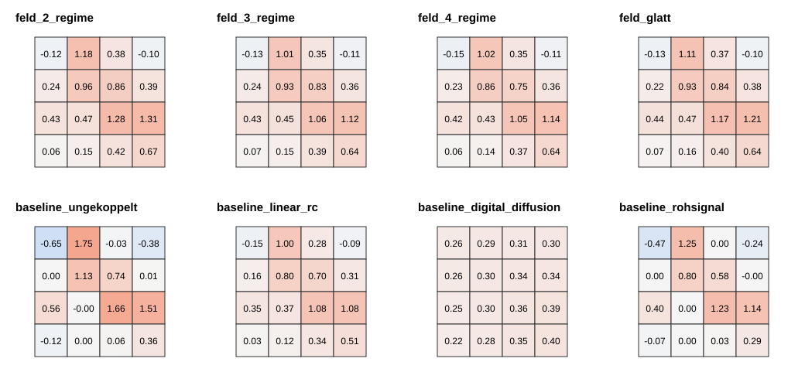

# Ergebnisbericht: mathematischer 4×4-Demonstrator

## Prüfziel

Geprüft wird, ob gekoppelte kontinuierliche Zellen unter identischen gestörten Eingangsmustern reproduzierbar trennbare Feldformen erzeugen. Der Arbeitsbereich bleibt für alle Feldvarianten bei −3 bis +3. Verglichen werden zwei, drei und vier Rückführungsregime sowie eine geglättete Dreiregime-Kennlinie.

## Vorab festgelegte Aufgabe

Sechs 4×4-Muster werden mit Verstärkungsstreuung, Offset, Pixelausfällen und drei Rauschstufen beaufschlagt. Pro Rauschstufe laufen fünf unabhängige Zufallsstarts. Die Auswertung verwendet acht vorab festgelegte Skalare: Summe, Betragsenergie, zwei Schwerpunktkoordinaten, zwei räumliche Ausdehnungen sowie positiven und negativen Spitzenwert. In beiden Fällen wird ein einfacher Nächste-Zentroid-Auswerter eingesetzt.

## Gesamtergebnis

Die höchste mittlere Trennrate erreichte `feld_3_regime` mit 63.2 %. Die beste Feldvariante war `feld_3_regime` mit 63.2 %. Die beste Baseline war `baseline_linear_rc` mit 62.4 %.

Differenz beste Feldvariante minus beste Baseline: +0.8 Prozentpunkte.

Damit ist ein Vorteil der Feldarchitektur in dieser Aufgabe nicht nachgewiesen; der Vorsprung bleibt unter der vorab festgelegten Schwelle.

Der gepaarte Unterschied über 15 identische Seed-Rausch-Kombinationen hat ein approximatives 95-%-Intervall von -0.8 bis +2.3 Prozentpunkten. Das Intervall schließt null ein.

## Zentrale Befunde und Nichtnachweise

- Die vier Feldkennlinien liegen bei der mittleren Trennrate eng beieinander. Der Abstand zwischen bester und schwächster Feldvariante beträgt nur 2.4 Prozentpunkte. Aus diesem Lauf folgt daher kein besonderer Vorteil von zwei, drei, vier oder geglätteten Regimen.
- Die beste Feldvariante liegt 0.8 Prozentpunkte vor der besten Baseline. Für die hier verwendete kompakte Auslese ist ein zusätzlicher Nutzen der nichtlinearen Feldbildung nicht nachgewiesen.
- Der Rückkehrerfolg der Feldvarianten liegt nach fünf normierten Sekunden nur zwischen 3.9 % und 5.4 %. Die gewählte schwache innere Rückführung erfüllt das Rückkehrkriterium damit nicht.
- Im regulären Lauf traten bei keiner Feldvariante versuchte Grenzüberschreitungen auf. Der höchste mittlere Betrag blieb bei 2.003 und damit deutlich innerhalb des Bereichs −3 bis +3.
- Die feste digitale Diffusion glättet die kleinen 4×4-Muster stark und ist in dieser einzelnen Parametrierung deutlich schlechter. Das ist kein allgemeiner Nachweis gegen digitale Verfahren; dafür wäre ein eigener Parametersweep erforderlich.

## Zusammenfassung der Modelle

| Modell | Trennrate | Trennverhältnis | Wiederhol-RMSE | Rückkehrerfolg | Rückkehrzeit | Grenzverletzungen |
|---|---:|---:|---:|---:|---:|---:|
| feld_2_regime | 60.8 ± 15.7 % | 0.726 | 0.173 | 3.9 % | 4.01 s | 0.0000 % |
| feld_3_regime | 63.2 ± 16.2 % | 0.724 | 0.159 | 3.9 % | 3.98 s | 0.0000 % |
| feld_4_regime | 62.8 ± 16.6 % | 0.703 | 0.161 | 5.4 % | 3.96 s | 0.0000 % |
| feld_glatt | 62.8 ± 15.7 % | 0.695 | 0.175 | 4.0 % | 3.99 s | 0.0000 % |
| baseline_ungekoppelt | 56.3 ± 20.9 % | 0.507 | 0.216 | 0.9 % | 4.34 s | 0.0000 % |
| baseline_linear_rc | 62.4 ± 17.3 % | 0.684 | 0.174 | 37.4 % | 3.73 s | 0.0000 % |
| baseline_digital_diffusion | 45.1 ± 7.1 % | 0.358 | 0.132 | n/a | n/a | 0.0000 % |
| baseline_rohsignal | 59.1 ± 22.0 % | 0.600 | 0.163 | n/a | n/a | 0.0000 % |

## Abbildungen

## Aussagegrenze

Dies ist ein dimensionsloses mathematisches Referenzmodell. Der Aktivitätswert ist nur ein Rechenproxy und keine elektrische Energiemessung. Bauteilrauschen, parasitäre Effekte, Temperatur und reale Ausleseschaltungen sind erst mit SPICE beziehungsweise Hardware belastbar prüfbar. Ein positives Ergebnis rechtfertigt den nächsten Simulationsschritt, aber noch keine Aussage über einen gefertigten Chip.

## Reproduzierbarkeit

Die vollständigen Einzelwerte stehen in `trials.csv`, die aggregierten Werte in `summary.csv`. `manifest.json` hält Modellparameter, Seeds und Stichprobengrößen fest. Der Lauf ist mit festen Seeds reproduzierbar.
