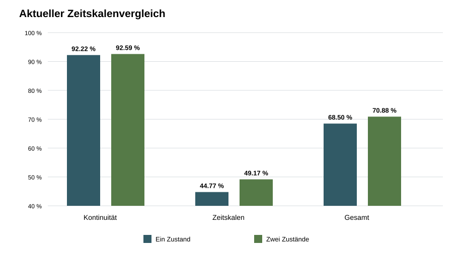

# Ergebnisbericht: mehrere lokale Zeitskalen

## Technische Zulassung

Von 28 Modellen sind `19` technisch zugelassen. Die neun Kandidaten mit `λ_langsam = 0,8` verfehlen die Grenze der 95-%-Einschwingzeit von `5,0 s` und werden nicht auf den Aufgaben bewertet.

## Explorative Auswahl

`zwei_zustaende_l1.2_s2_a0.5` wurde als Kandidat für einen späteren Bestätigungslauf ausgewählt.

Die Gesamttrennrate steigt explorativ von `68.50 %` auf `70.88 %`. Die gepaarte Differenz beträgt `+2.38` Prozentpunkte mit einem approximativen 95-%-Intervall von `+0.77` bis `+4.00` Prozentpunkten.

Kontinuitätsaufgabe: `+0.37` Punkte. Zeitskalenaufgabe: `+4.40` Punkte. Die mittleren Unterschiede bleiben auch bei allen drei Rauschstufen nichtnegativ.

Ein zweiter Kandidat erreicht dieselbe beobachtete Gesamttrennrate. Gemäß der vorregistrierten Gleichstandsregel wird das Modell mit dem kleineren Verhältnis `λ_schnell/λ_langsam` ausgewählt.

Der ausgewählte Kandidat besitzt im technischen Screening eine schlechteste 95-%-Einschwingzeit von `3.490 s`, einen schlechtesten Restfehler von `0.00891` und keine versuchte Grenzüberschreitung.

## Abbildung

## Einordnung

Der Kandidat rechtfertigt einen neuen unabhängigen Bestätigungslauf mit frischen Seeds. Das explorative Ergebnis bestätigt noch keinen Verarbeitungsvorteil; außerdem bleiben zusätzlicher Schaltungsaufwand, Fläche und elektrische Energie ungeprüft.

## Reproduzierbarkeit

Zwei vollständige Ausführungen nach Korrektur der vorregistrierten Gleichstandsbehandlung erzeugten die zentralen Dateien bitgenau identisch.

- `technical_screen.csv`: SHA-256 `900CDB777B30AA6BF082016AF12780DD1981715B15977F185C4B64C9AB2BE869`
- `task_trials.csv`: SHA-256 `33476060BB46CCA24796BAC6DC050635A3C285D0BFCC85D4304FB518243ACF56`
- `comparisons.csv`: SHA-256 `236C828AF266F82C1328D5A117582B7B04AD6C5117EC4BFD9106895BD93869D1`
- `manifest.json`: SHA-256 `B57FDB0AB334730E723679C63C863C4D6E610B6BABC3F527FE687E64933142E9`
