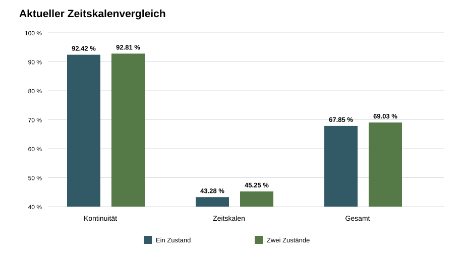

# Ergebnisbericht: Bestätigung lokaler Zeitskalen

## Ergebnis

Mindestens eine vorregistrierte Bedingung ist nicht erfüllt. Der explorative Vorteil ist nicht bestätigt.

Dieser Bericht bezieht sich ausschließlich auf den vorregistrierten Kandidaten und die Ein-Zustands-Baseline.

## Technische Pflichtprüfung

Beide Modelle erfüllen sämtliche technischen Kriterien. Der Kandidat erreicht über die neuen Seeds eine schlechteste 95-%-Einschwingzeit von `3.850 s`, einen schlechtesten Restfehler von `0.01256` und keine versuchte Grenzüberschreitung.

## Kennzahlen

Die Gesamttrennrate beträgt `67.85 %` für die Baseline und `69.03 %` für den Kandidaten. Die gepaarte Differenz ist `+1.18` Prozentpunkte; das approximative 95-%-Intervall reicht von `+0.15` bis `+2.21` Prozentpunkten.

Kontinuitätsaufgabe: `+0.39` Punkte. Zeitskalenaufgabe: `+1.97` Punkte.

| Vorregistrierte Bedingung | Ergebnis | Erfüllt |
|---|---:|:---:|
| Gesamtdifferenz größer als `2,0` Punkte | +1.18 | nein |
| Untere 95-%-Grenze größer als null | +0.15 | ja |
| Beide Aufgabenmittel mindestens null | +0.39 | ja |
| Alle Rauschmittel mindestens null | +0.88 | ja |

Der Effekt bleibt in Richtung der Exploration positiv, erreicht aber nicht die vorab verlangte Mindestgröße. Der explorative Vorteil ist deshalb nicht bestätigt.

## Abbildung

## Reproduzierbarkeit

Zwei vollständige Ausführungen erzeugten die zentralen Dateien bitgenau identisch.

- `technical_screen.csv`: SHA-256 `A0565B404E1D4F754E49505E873BD31F0523BD9B98023295944423C09B60AF89`
- `task_trials.csv`: SHA-256 `57F032BF9BB204A782FF4735EF4E0F2FADC4C163C05F4A4EC05781804341A5C1`
- `manifest.json`: SHA-256 `8A5C4B5A7D2914AFEE9E0672A169E3B6A9FB095A983A2C3D168611B545FFA13C`

## Aussagegrenze

Das Ergebnis gilt nur für die beiden eingefrorenen Modelle, Aufgaben und Simulationsbedingungen. Es belegt keinen Chipvorteil und keine elektrische Realisierbarkeit.
