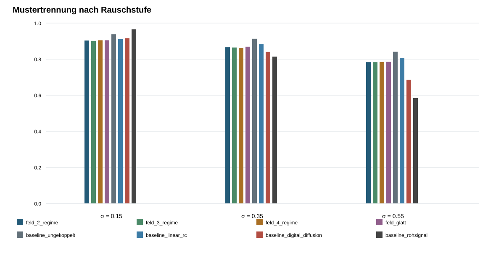

# Ergebnisbericht: zeitlich-räumlicher Hauptversuch

## Prüfziel

Geprüft wird die vorregistrierte Frage, ob ein gekoppeltes `4×4`-Feld zehn zeitlich-räumliche Sequenzklassen unter derselben kompakten 16-Kanal-Auslese besser trennt als die beste Baseline.

## Ergebnis

Beste Feldvariante: `feld_glatt`. Beste Baseline: `baseline_ungekoppelt`.

Gepaarte Differenz: -4.5 Prozentpunkte; approximatives 95-%-Intervall -5.5 bis -3.5 Prozentpunkte.

Mindestens eine vorregistrierte Bedingung ist nicht erfüllt. Ein Vorteil ist in dieser Aufgabe nicht nachgewiesen.

Die Auswahl der jeweils besten Variante war vorregistriert, enthält aber einen explorativen Auswahlanteil.

Das ungekoppelte dynamische Array liegt in allen drei Rauschstufen vor den gekoppelten Feldvarianten. Die zeitliche Zustandsbildung ist damit in dieser Aufgabe nützlich, die zusätzliche räumliche Kopplung in der festgelegten Parametrierung jedoch nicht. Daraus folgt keine allgemeine Aussage über andere Kopplungstopologien oder Ausleseverfahren.

## Modellübersicht

| Modell | Trennrate | Trennverhältnis | Wiederhol-RMSE | Maximalbetrag |
|---|---:|---:|---:|---:|
| feld_2_regime | 85.1 ± 5.5 % | 0.983 | 0.066 | 1.176 |
| feld_3_regime | 85.0 ± 5.6 % | 0.982 | 0.066 | 1.117 |
| feld_4_regime | 85.0 ± 5.5 % | 0.991 | 0.065 | 1.081 |
| feld_glatt | 85.3 ± 5.6 % | 0.975 | 0.066 | 1.138 |
| baseline_ungekoppelt | 89.7 ± 4.5 % | 1.151 | 0.059 | 1.174 |
| baseline_linear_rc | 86.7 ± 5.0 % | 1.036 | 0.061 | 1.034 |
| baseline_digital_diffusion | 81.4 ± 10.4 % | 0.723 | 0.053 | 1.463 |
| baseline_rohsignal | 78.8 ± 16.8 % | 0.649 | 0.053 | 1.875 |

## Abbildung

## Aussagegrenze

Das Ergebnis gilt nur für die festgelegten Sequenzen, Störungen, Modelle und die feste Auslese. Fertigbarkeit und elektrische Größen sind damit nicht geprüft.

## Reproduzierbarkeit

Die CSV-Dateien werden mit festen Seeds deterministisch erzeugt. Zwei vollständige Läufe wurden zusätzlich bitgenau verglichen.

- `summary.csv`: SHA-256 `9EA67AADE7BE2820D61789A83B2F5AF767C8F85E821799C0E9D5574463EB4125`
- `trials.csv`: SHA-256 `6D97EDB758C0CDC6BD81D0EF41576DAC2E7ECA5CC6C0D7AA70A2FD596F1F833D`
